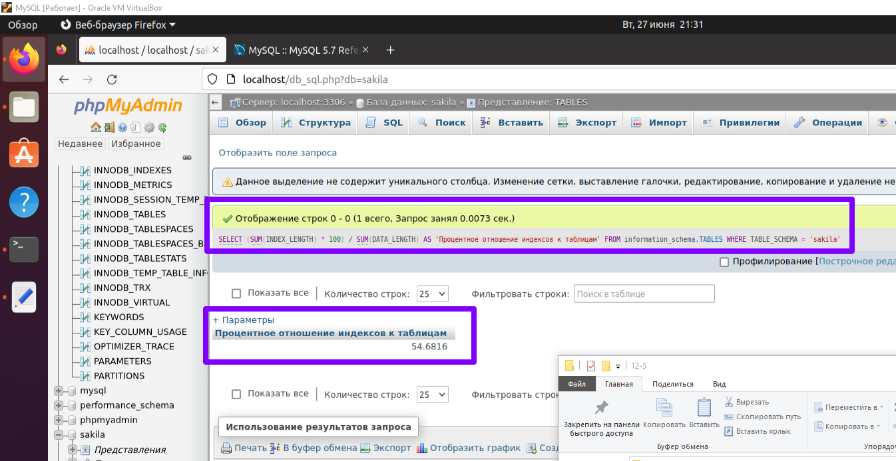
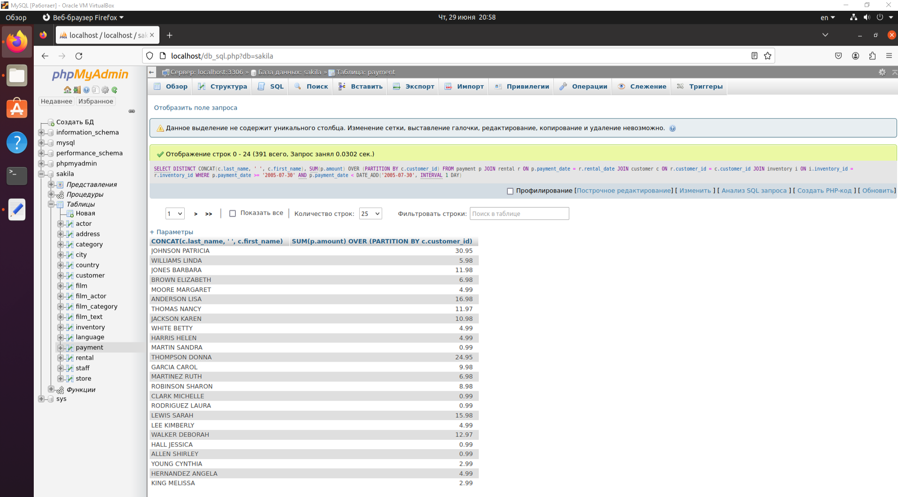
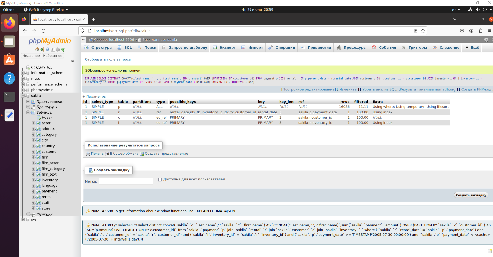

# Домашнее задание к занятию 12.5. «Индексы»

### Задание 1

Напишите запрос к учебной базе данных, который вернёт процентное отношение общего размера всех индексов к общему размеру всех таблиц.

SELECT  
    (SUM(INDEX_LENGTH) * 100) / SUM(DATA_LENGTH) AS 'Процентное отношение индексов к таблицам'  
FROM  
    information_schema.TABLES  
WHERE  
    TABLE_SCHEMA = 'sakila';  



### Задание 2

Выполните explain analyze следующего запроса:
```sql
select distinct concat(c.last_name, ' ', c.first_name), sum(p.amount) over (partition by c.customer_id, f.title)
from payment p, rental r, customer c, inventory i, film f
where date(p.payment_date) = '2005-07-30' and p.payment_date = r.rental_date and r.customer_id = c.customer_id and i.inventory_id = r.inventory_id
```
- перечислите узкие места;

Использование оконной функции SUM() OVER (PARTITION BY...): влияет на производительность запроса, если данных много;

Много сравнений WHERE;

Использование функции DATE: Использование функций в условиях WHERE может привести к невозможности использования индексов в соответствующих столбцах. 

- оптимизируйте запрос: внесите корректировки по использованию операторов, при необходимости добавьте индексы.

SELECT DISTINCT CONCAT(c.last_name, ' ', c.first_name), SUM(p.amount) OVER (PARTITION BY c.customer_id, f.title)  
FROM payment p  
JOIN rental r ON p.payment_date = r.rental_date  
JOIN customer c ON r.customer_id = c.customer_id  
JOIN inventory i ON i.inventory_id = r.inventory_id  
JOIN film f ON f.film_id = i.film_id  
WHERE DATE(p.payment_date) = '2005-07-30';  





## Дополнительные задания (со звёздочкой*)
Эти задания дополнительные, то есть не обязательные к выполнению, и никак не повлияют на получение вами зачёта по этому домашнему заданию. Вы можете их выполнить, если хотите глубже шире разобраться в материале.

### Задание 3*

Самостоятельно изучите, какие типы индексов используются в PostgreSQL. Перечислите те индексы, которые используются в PostgreSQL, а в MySQL — нет.

*Приведите ответ в свободной форме.*
