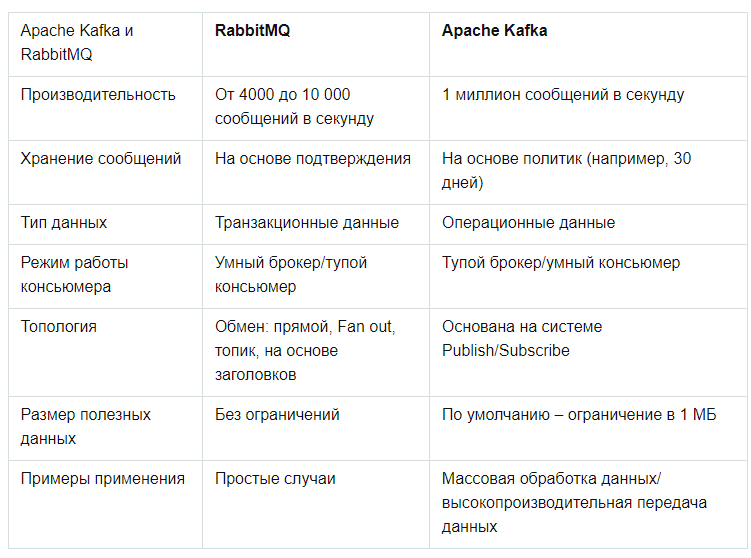

# Домашнее задание к занятию 10.2 «Кластеризация»

---

### Задание 1

В чём различие между SMP- и MPP-системами?

*Приведите ответ в свободной форме.*

MPP массивно-параллельная архитектура. Главная особенность такой архитектуры состоит в том, что память физически разделена

SMP симметричная многопроцессорная архитектура. Главной особенностью систем с архитектурой SMP является наличие общей физической памяти, разделяемой всеми процессорами

---

### Задание 2

В чём отличие сильно связанных и слабо связанных систем?

*Приведите ответ в свободной форме.*

Сильно связанная система состоит из нескольких однородных
процессоров и массива общей памяти (обычно из нескольких
независимых блоков)

В слабо связанных системах вся память распределена между
процессорными элементами. 

---

### Задание 3

Какие преимущества отличают кластерные системы от обычных серверов?

*Приведите ответ в свободной форме.*

абсолютная масштабируемость

нет ограничений на размер узлов и кластеров

наращиваемая масштабируемость

высокий коэффициент готовности

отказоустойчивость, благодаря автономности узлов

можно строить кластер из любых строительных блоков: чем
проще и стандартнее блоки, тем дешевле обходится
вычислительная мощность
---

### Задание 4

Приведите примеры типов современных кластерных систем.

*Приведите ответ в свободной форме.*

● отказоустойчивые кластеры (High-availability clusters, HA,
кластеры высокой доступности);
● кластеры с балансировкой нагрузки (Load balancing clusters);
● вычислительные кластеры (High performance computing
clusters, HPC);
● системы распределенных вычислений.
---

### Задание 5

Где используют сервис Kafka, rabitMQ?

*Приведите ответ в свободной форме.*

RabbitMQ часто сравнивают с другим популярным брокером сообщений — Apache Kafka. Оба инструмента используются для обмена данными между приложениями, но реализуют принципиально разные модели доставки. RabbitMQ — push, когда сообщения отправляются получателям, а Kafka — pull, получатели сами достают сообщения из топика.

---

## Задания со звёздочкой*
Эти задания дополнительные. Их можно не выполнять. На зачёт это не повлияет. Вы можете их выполнить, если хотите глубже разобраться в материале.

