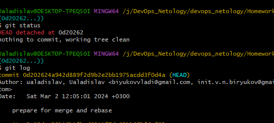
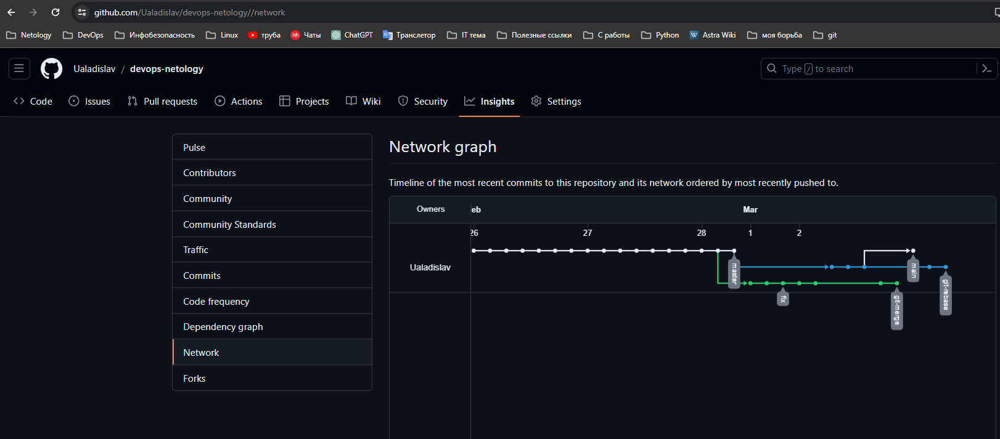
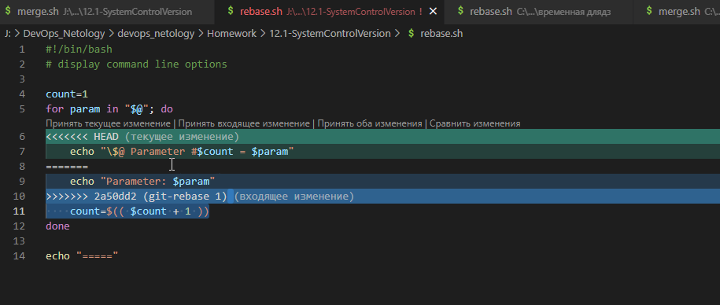
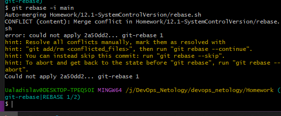
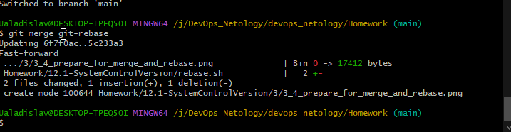

# Домашнее задание к занятию «Ветвления в Git»

---

### Задание Ветвление, merge и rebase

Установите Prometheus.

*Приведите скриншот systemctl status prometheus, где будет написано: prometheus.service — Prometheus Service Netology Lesson 9.4 — [Ваши ФИО].*

---