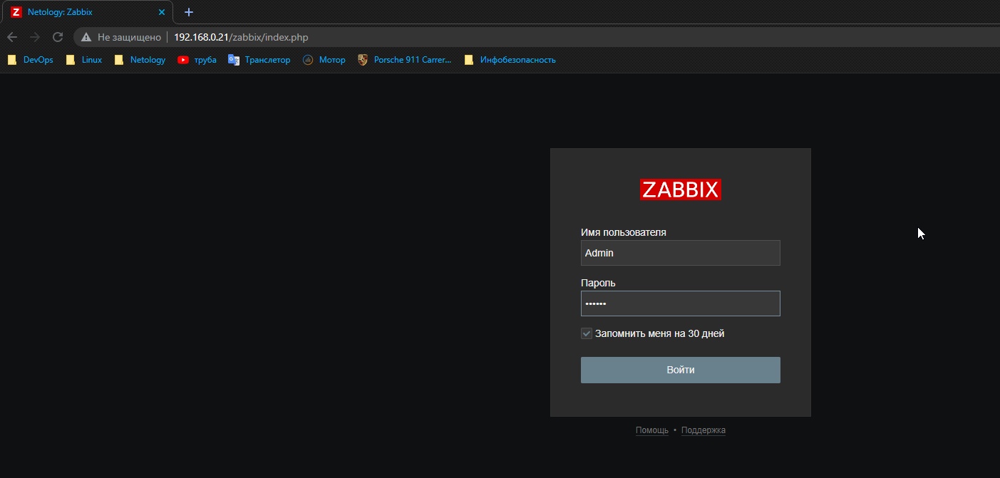
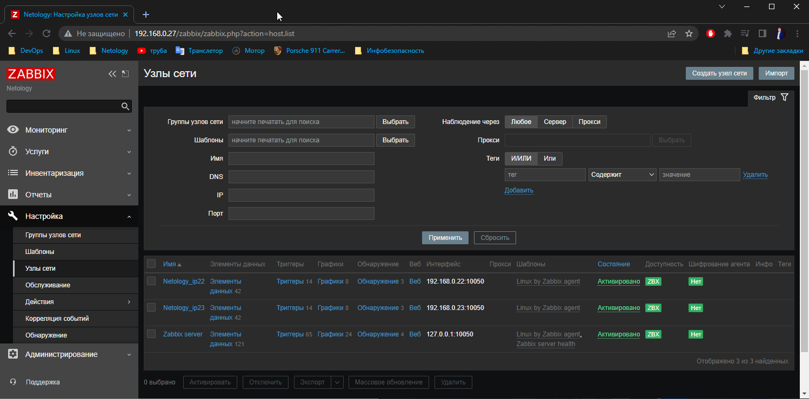
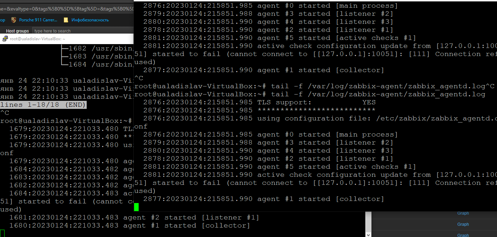

# Домашнее задание к занятию 9.2 «Zabbix. Часть 1»

### Задание 1 

Установите Zabbix Server с веб-интерфейсом.

*Приложите скриншот авторизации в админке.*
*Приложите текст использованных команд в GitHub.*

sudo apt install postgresql-14

wget https://repo.zabbix.com/zabbix/6.0/debian/pool/main/z/zabbix-release/zabbix-release_6.0-4%2Bdebian11_all.deb

dpkg -i zabbix-release_6.0-4+debian11_all.deb 
apt update 

sudo apt install zabbix-server-pgsql zabbix-frontend-php php7.4-pgsql zabbix-apache-conf zabbix-sql-scripts nano -y zabbix-agent 

su - postgres -c 'psql --command "CREATE USER zabbix WITH PASSWORD '\'123456789\'';"'

su - postgres -c 'psql --command "CREATE DATABASE zabbix OWNER zabbix;"'

systemctl status zabbix-agent.service apache2 zabbix-server.sevice

---

### Задание 2 

Установите Zabbix Agent на два хоста.

*Приложите скриншот раздела Configuration > Hosts, где видно, что агенты подключены к серверу.*

*Приложите скриншот лога zabbix agent, где видно, что он работает с сервером.*

*Приложите скриншот раздела Monitoring > Latest data для обоих хостов, где видны поступающие от агентов данные.*

*Приложите текст использованных команд в GitHub.*
# Установите Zabbix Server и компоненты
sudo apt install zabbix-agent -y
# Запустите Zabbix Agent
sudo systemctl restart zabbix-agent
sudo systemctl enable zabbix-agent
# Меняем адрес сервера в zabbix_agentd.conf
sed -i 's/Server=127.0.0.1/Server=192.168.0.27/g' /etc/zabbix/zabbix_server.conf
