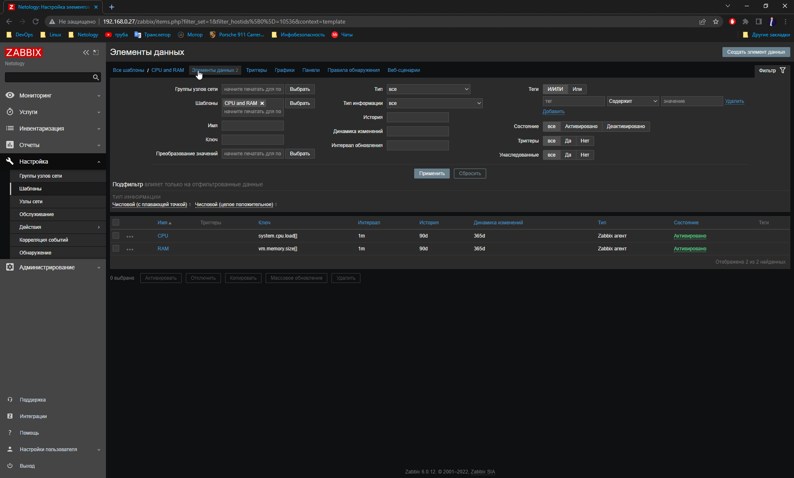
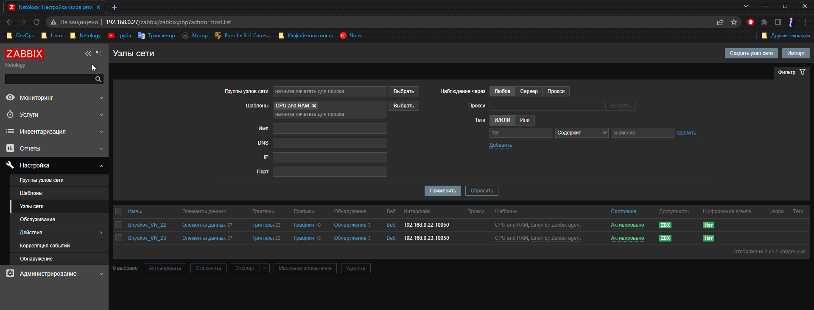
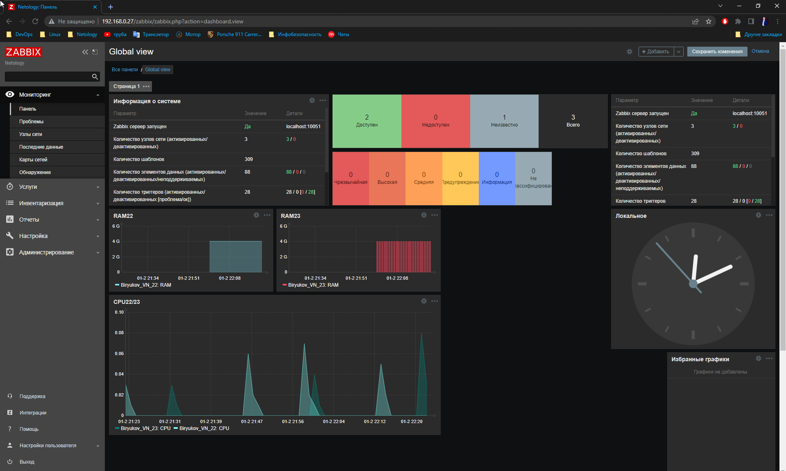

# Домашнее задание к занятию «9.3-Zabbix-2t»

### Задание 1

**Что нужно сделать:**

Создайте свой шаблон, в котором будут элементы данных, мониторящие загрузку CPU и RAM хоста.

Сохраните в Git скриншот страницы шаблона с названием «Задание 1».

---

### Задание 2

**Что нужно сделать:**

Привяжите созданный шаблон к двум хостам. Также привяжите к обоим хостам шаблон Linux by Zabbix Agent.

Результат этого задания сдавайте вместе с заданием 3.

---

### Задание 3

**Что нужно сделать:**

Привяжите созданный шаблон к двум хостам. Также привяжите к обоим хостам шаблон Linux by Zabbix Agent.

Сохраните в Git скриншот страницы хостов, где будут видны привязки шаблонов с названиями «Задание 2-3». Хосты должны иметь зелёный статус подключения.

---

### Задание 4

**Что нужно сделать:**

Создайте свой кастомный дашборд.

Создал два графика RAM22 и RAM23, который показывает свободную память (4гб)

Так же запилил график, который показывает загрузку CPU на двух хостах - CPU22/23

Понажимал разные кнопочки, не получилось с наскоку вытащить часы с хостов, видимо для них нужно создавать отдельный итем, верно?
 
Сохраните в Git скриншот дашборда с названием «Задание 4».

